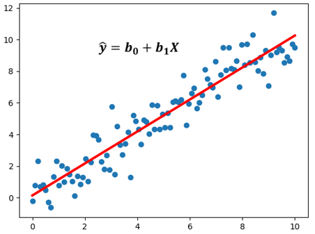

# Regresión lineal

La regresión lineal es un modelo matemático que predice valores mediante variables relacionadas, lo que permite crear predicciones utilizando fórmulas faciles de interpretrar. La regresión lineal se utiliza para predecir el valor de una variable mediante otra variable, la variable a predecir se llama dependiente y la que se utiliza para predecir el valor se llama independiente. 

Es muy común utilizarlo en los campos científicos y en los negocias, aunque en este caso lo vamos a utilizar para el aprendizaje automático.

